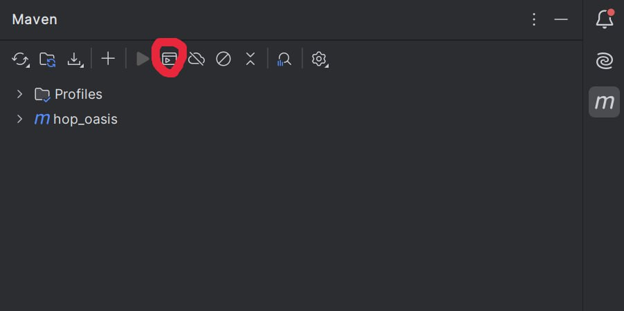

📌 Features:
Product management (create, edit, delete)
Order processing and payments
User authentication and role management
Integration with external APIs (e.g., payment systems)
🚀 Tech stack: Java, Spring Boot, Spring Security, Hibernate, PostgreSQL, Docker.

👷‍♀️ Local Setup Instructions:
1. Install Java 21 via Terminal
   ```sh
   Linux
   sudo apt update
   sudo apt install openjdk-21-jdk
   java -version  # Check installation
   
   Windows
   winget install --id Oracle.JDK.21
   java -version
   
   macOS
   brew install java@21
   java -version
   
2. Install Maven via Terminal
   
   ```sh
   Linux
   sudo apt update
   sudo apt install maven
   mvn -version
   
   Windows
   winget install Apache.Maven
   mvn -version
   
   macOS
   brew install maven
   mvn -version
   
3. Download and install IntelliJ IDEA (Community or Ultimate) from the official website:
   🔗 https://www.jetbrains.com/idea/download/

4. Open IntelliJ IDEA.
5. Clone the repository:
   https://github.com/hopOasis/hopOasis_be.git


   
   

6. Open the project in IntelliJ IDEA.
7. Click on Fetch to download all remote branches.
   


8. Make checkout to branch render_deploy
   


9. Choose and open the file application.properties

   

10. Ask the PM for the application.properties file with environment variables.
   Once you receive the file from the PM, open it.
   Copy all the content from the PM's file.
   Open your application.properties file.
   Remove all content in application.properties.
   Paste the content you copied from the PM's file into application.properties.


11. Build the project via Terminal and wait for the build to finish.:
   ```sh
      mvn install -DskipTests -Dcheckstyle.skip
   ```
copy and past the command and press enter or click on the single green button.

If you have a problem with Windows, you can try running Maven via IntelliJ IDEA.
Make sure to select the terminal and choose the correct Java version



 


12. You will see BUILD SUCCESSFUL in the terminal if all did correct.
  

13. Run the app via Terminal:
    copy and past the command and press enter or click on the single green button.
   ```sh
      mvn spring-boot:run -DskipTests=true -Dcheckstyle.skip=true
   ```
   
14. Open the browser and navigate to http://localhost:8080/beers
    if everything is working correctly you will see some list of beers like this:
    


                                                 Basic Git Workflow Rules

                   1. Creating a New Branch

                        A new branch is created from the render_deploy branch.

                        The branch name should be informative and reflect the task's essence.

                   2. Commits

                       It is recommended to make no more than 5 commits per task.

                       Each commit should be as informative as possible and clearly describe what was done.

                   3. Pull Request (PR)

                      After completing a task, a Pull Request must be created.

                      A Pull Request is considered successful if it receives 2 approvals from developer and the PM.

                      An approved branch is merged into render_deploy.
    
